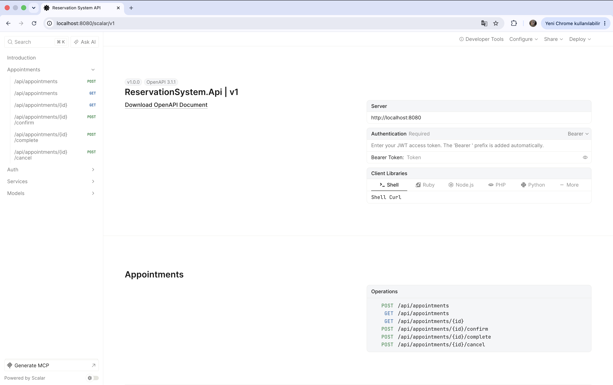
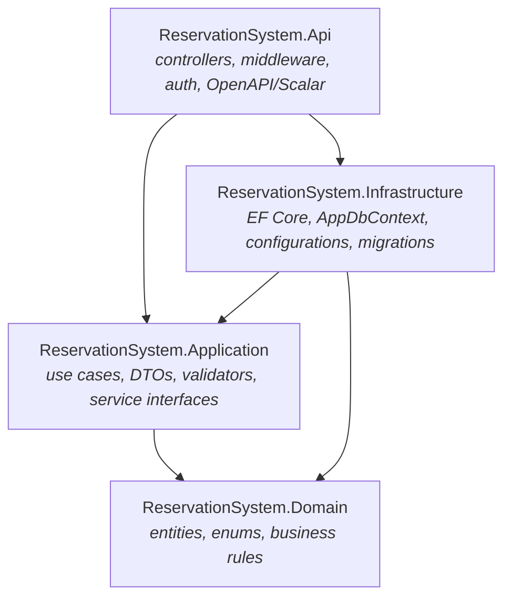

# Reservation System API

A production-style **reservation / appointment management REST API** built with
.NET 10 and a clean, layered architecture — featuring JWT auth with refresh-token
rotation, role-based access, and race-condition-proof appointment booking backed
by a PostgreSQL exclusion constraint.

[](https://github.com/sevimakpinareng/reservation-api/actions/workflows/ci.yml)


[](LICENSE)

> 🔗 **Live demo:** [Scalar API reference](https://reservation-api-tslv.onrender.com/scalar/v1) ·
> [health check](https://reservation-api-tslv.onrender.com/health)
>
> ⏳ The demo runs on Render's free tier, which sleeps when idle — the **first
> request after inactivity can take ~50 s** (cold start). Subsequent calls are fast.

[](https://reservation-api-tslv.onrender.com/scalar/v1)

## ✨ Highlights

- 🔐 **JWT authentication** (access + refresh) with **refresh-token rotation** —
  every refresh revokes the old token; passwords hashed with **BCrypt**.
- 👥 **Role-based authorization** (`Customer` / `BusinessOwner` / `Admin`) via
  named policies.
- 📅 **Appointment booking with conflict detection** — server-computed end times,
  no past bookings, validated status transitions.
- 🛡️ **Double-booking made impossible** — application-level overlap check inside a
  transaction **plus** a PostgreSQL **GiST exclusion constraint** as a hard guard
  ([details below](#-standout-technical-decision-preventing-double-booking)).
- 🔎 **Pagination, filtering & sorting** on list endpoints with safe bounds.
- ✅ **69 automated tests** — fast unit tests **and** Testcontainers-backed
  integration tests against real PostgreSQL, including a **true concurrency test**.
- 🧱 **Clean layered architecture**, RFC 7807 **ProblemDetails** errors, structured
  **Serilog** logging, **OpenAPI + Scalar** docs.
- 🐳 **Dockerized** (multi-stage, non-root) with **CI** on GitHub Actions.

## 🧰 Tech stack

| Concern          | Technology                                          |
| ---------------- | --------------------------------------------------- |
| Runtime          | .NET 10 (LTS), C# 14                                 |
| Web framework    | ASP.NET Core Web API                                 |
| Database         | PostgreSQL 17                                        |
| ORM              | Entity Framework Core 10 (Npgsql provider)           |
| Auth             | JWT bearer (access + refresh), BCrypt                |
| Validation       | FluentValidation                                     |
| API docs         | OpenAPI + [Scalar](https://scalar.com)               |
| Logging          | Serilog (structured)                                 |
| Testing          | xUnit, FluentAssertions, Testcontainers              |
| Tooling / DevOps | Docker, Docker Compose, GitHub Actions               |

## 🏛️ Architecture

Clean, layered architecture — dependencies point inward toward the domain:



| Layer              | Responsibility                                                              |
| ------------------ | -------------------------------------------------------------------------- |
| **Domain**         | Entities, enums, and pure business rules (e.g. `AppointmentRules`). No deps.|
| **Application**    | Use cases, DTOs, validators, service contracts (`IApplicationDbContext`).   |
| **Infrastructure** | EF Core `AppDbContext`, Fluent API configs, migrations, the overlap constraint. |
| **Api**            | HTTP endpoints, auth/policies, exception handling, OpenAPI/Scalar, DI wiring.|

### Domain model

- **User** — `Email`, `PasswordHash`, `FullName`, `Role` (`Customer` / `BusinessOwner` / `Admin`)
- **Service** — `Name`, `Description`, `DurationMinutes`, `Price`, `IsActive`
- **Appointment** — `CustomerId` → User, `ServiceId` → Service, `StartTime`/`EndTime` (UTC), `Status` (`Pending` / `Confirmed` / `Cancelled` / `Completed`)
- **RefreshToken** — `UserId` → User, `Token`, `ExpiresAt`, `RevokedAt`, `IsRevoked`

All entities derive from `BaseEntity` (`Id`, `CreatedAt`, `UpdatedAt`, `IsDeleted`).
Soft deletes are enforced by a global query filter; timestamps are maintained
automatically in `SaveChanges`.

## 🚀 Quick start (Docker)

**Prerequisites:** [Docker Desktop](https://www.docker.com/products/docker-desktop/).
The whole stack (API + PostgreSQL) comes up with one command.

```bash
# 1. Provide local secrets (gitignored)
cp .env.example .env
#    then edit POSTGRES_PASSWORD and JWT_SECRET in .env
#    generate a strong secret with:  openssl rand -base64 48

# 2. Build and start API + PostgreSQL
docker compose up -d --build
```

The API applies migrations on startup and is then available at:

| What            | URL                                   |
| --------------- | ------------------------------------- |
| API base        | `http://localhost:8080`               |
| Scalar API docs | `http://localhost:8080/scalar/v1`     |
| OpenAPI JSON    | `http://localhost:8080/openapi/v1.json` |
| Health check    | `http://localhost:8080/health`        |

```bash
docker compose down       # stop (keeps data volume)
docker compose down -v    # stop and wipe data
```

## 🛠️ Local development (without containerizing the API)

**Prerequisites:** [.NET 10 SDK](https://dotnet.microsoft.com/download),
Docker (for PostgreSQL), and EF tools (`dotnet tool install --global dotnet-ef`).

```bash
# 1. Start only PostgreSQL
docker compose up -d postgres

# 2. Point the API at it + set a JWT secret (user-secrets; gitignored)
cd src/ReservationSystem.Api
dotnet user-secrets set "ConnectionStrings:DefaultConnection" \
  "Host=localhost;Port=5433;Database=reservationdb;Username=reservation;Password=<your-password>"
dotnet user-secrets set "Jwt:Secret" "$(openssl rand -base64 48)"
cd -

# 3. Apply migrations and run
dotnet ef database update \
  --project src/ReservationSystem.Infrastructure \
  --startup-project src/ReservationSystem.Api
dotnet run --project src/ReservationSystem.Api
```

> `POSTGRES_PORT` in `.env` is the **host** port for PostgreSQL (default `5432`;
> set to `5433` if `5432` is already taken). Inside the compose network the API
> always reaches PostgreSQL on `5432`.

## 🔧 Configuration & secrets

**No passwords, connection strings, or secrets are committed.** `appsettings.json`
ships with empty placeholders; real values come from a gitignored `.env`
(Compose), .NET user-secrets, or environment variables. The app **fails fast** if
`Jwt:Secret` is missing.

| Setting                     | Env var (Compose)            | Default             |
| --------------------------- | ---------------------------- | ------------------- |
| Connection string           | `ConnectionStrings__DefaultConnection` | _(required)_ |
| JWT signing secret (≥32 ch) | `Jwt__Secret`                | _(required)_        |
| JWT issuer                  | `Jwt__Issuer`                | `ReservationSystem` |
| JWT audience                | `Jwt__Audience`              | `ReservationSystem` |
| Access token lifetime (min) | `Jwt__AccessTokenMinutes`    | `15`                |
| Refresh token lifetime (d)  | `Jwt__RefreshTokenDays`      | `7`                 |
| Migrate on startup          | `Database__MigrateOnStartup` | `false`             |

## 📡 API reference

All errors use RFC 7807 **ProblemDetails** with meaningful status codes
(`400` validation/business rule, `401` unauthenticated, `403` forbidden,
`404` not found, `409` conflict).

### Auth — `/api/auth`

| Method | Route       | Auth     | Description                          |
| ------ | ----------- | -------- | ------------------------------------ |
| POST   | `/register` | Public   | Create a Customer account, get tokens |
| POST   | `/login`    | Public   | Authenticate, get a token pair       |
| POST   | `/refresh`  | Public¹  | Rotate refresh token, get a new pair |
| POST   | `/logout`   | Bearer   | Revoke a refresh token               |
| GET    | `/me`       | Bearer   | Current user's profile               |

¹ Requires a valid (unexpired, unrevoked) refresh token in the body.

The **access token** is short-lived and carries `sub`, `email`, `name`, `role`
claims. The **refresh token** is long-lived, opaque, stored in the DB, and
**rotated on every use** (the presented token is revoked).

### Services — `/api/services`

| Method | Route   | Auth                  | Description                       |
| ------ | ------- | --------------------- | --------------------------------- |
| GET    | `/`     | Public                | Paged list (active only default)  |
| GET    | `/{id}` | Public                | Single service                    |
| POST   | `/`     | BusinessOwner / Admin | Create (201 + `Location`)         |
| PUT    | `/{id}` | BusinessOwner / Admin | Update                            |
| DELETE | `/{id}` | BusinessOwner / Admin | Soft delete (204)                 |

List query params: `page`, `pageSize` (max **100**), `search` (case-insensitive
name match), `sortBy` (`CreatedAt` | `Name` | `Price`), `sortDescending`,
`isActive` (omit ⇒ active only). Responses use
`PagedResult<T>` — `{ items, page, pageSize, totalCount, totalPages }`.

### Appointments — `/api/appointments`

| Method | Route            | Auth                  | Description                       |
| ------ | ---------------- | --------------------- | --------------------------------- |
| POST   | `/`              | Any authenticated     | Book a slot (201 + `Location`)    |
| GET    | `/`              | Any authenticated     | Paged list (own only for customers) |
| GET    | `/{id}`          | Owner / staff         | Single appointment                |
| POST   | `/{id}/confirm`  | BusinessOwner / Admin | `Pending → Confirmed`             |
| POST   | `/{id}/complete` | BusinessOwner / Admin | `Confirmed → Completed`           |
| POST   | `/{id}/cancel`   | Owner / staff         | `Pending`/`Confirmed → Cancelled` |

Server-enforced rules: end time is **computed** (`StartTime + DurationMinutes`);
**no past bookings**; **no overlaps** for the same service (`409`);
inactive/deleted services can't be booked; status transitions are validated;
customers only see/act on their own appointments. List params: `page`, `pageSize`,
`status`, `serviceId`, `from`/`to` (UTC range), `sortBy`
(`StartTime` | `CreatedAt` | `Status`), `sortDescending`.

> **Getting a BusinessOwner account:** registration always creates a `Customer`.
> Promote a user in the database, then log in again for a fresh token:
> ```bash
> docker exec -e PGPASSWORD=<password> reservation-postgres \
>   psql -U reservation -d reservationdb \
>   -c "UPDATE users SET \"Role\"='BusinessOwner' WHERE \"Email\"='you@example.com';"
> ```

## 🛡️ Standout technical decision: preventing double-booking

Two clients can race for the same time slot. A naïve "check then insert" lets both
pass the check before either writes — producing a double-booking. This API closes
that gap with **two layers**:

1. **Application** — the overlap check and the insert run inside a single
   **transaction**, returning a friendly `409` in the common case. Overlap uses
   half-open intervals (`newStart < existingEnd && newEnd > existingStart`), so a
   booking that starts exactly when another ends is allowed.
2. **Database (the real guarantee)** — a PostgreSQL **GiST exclusion constraint**
   (`ck_appointments_no_overlap`, using `btree_gist`) makes overlapping
   `[StartTime, EndTime)` ranges for the same non-cancelled service **physically
   impossible**. If two requests slip past the app check simultaneously, the
   database rejects the loser; the API maps that to a `409`.

Correctness therefore never depends on application timing — the database is the
final arbiter. This is proven by an automated **concurrency test** that fires two
identical bookings in parallel and asserts **exactly one `201` and one `409`**.

## 🧪 Testing

**69 tests** across two tiers in `tests/ReservationSystem.Tests`:

- **Unit** (`Unit/`) — fast, no I/O: booking rules (overlap/half-open, end-time,
  status transitions), BCrypt hashing, and the FluentValidation validators.
- **Integration** (`Integration/`) — the real API over HTTP via
  `WebApplicationFactory<Program>` against a throwaway **PostgreSQL 17** container
  (**Testcontainers**), with migrations applied (incl. the GiST constraint). Each
  test resets the database, so they are deterministic and order-independent.
  Covers the full auth flow, service authorization/CRUD, and every appointment
  rule — plus the **concurrency test** described above.

```bash
# Run everything (Docker Desktop must be running for Testcontainers)
dotnet test

# Fast unit tests only
dotnet test --filter "FullyQualifiedName~Unit"
```

CI runs the same suite on every push/PR — see [`.github/workflows/ci.yml`](.github/workflows/ci.yml).

## 🚢 Deployment

A multi-stage [`Dockerfile`](Dockerfile) produces a small, non-root runtime image.
The app adapts to its host automatically: it binds to a `PORT` env var if injected
and converts a `DATABASE_URL` (e.g. `postgresql://...`) into an Npgsql connection
string — so PaaS platforms work without extra wiring.

A [`render.yaml`](render.yaml) **Blueprint** provisions the database + API on
[Render](https://render.com) in one click (**New → Blueprint → pick repo →
Apply**). See **[DEPLOYMENT.md](DEPLOYMENT.md)** for the Blueprint walkthrough, a
manual fallback, and a platform-agnostic guide (env vars, migration strategy).

## 📄 License

Released under the [MIT License](LICENSE).

## 🗺️ Roadmap

- [x] **Phase 1** — Solution scaffolding, infrastructure, domain model
- [x] **Phase 2** — Authentication & authorization (JWT + refresh rotation, roles)
- [x] **Phase 3** — Service management CRUD (pagination, filtering, role-based access)
- [x] **Phase 4** — Appointment booking (conflict detection, status transitions, RBAC)
- [x] **Phase 5** — Tests (unit + Testcontainers integration, incl. concurrency)
- [x] **Phase 6** — CI/CD, Dockerfile, deployment guide, documentation
